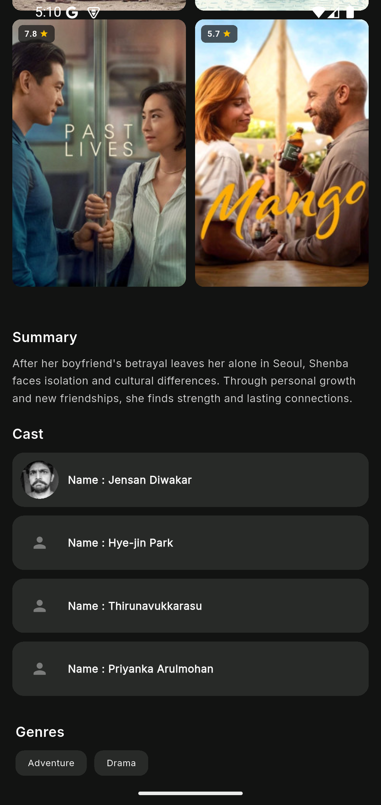
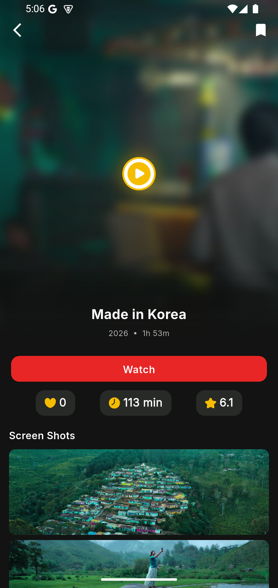
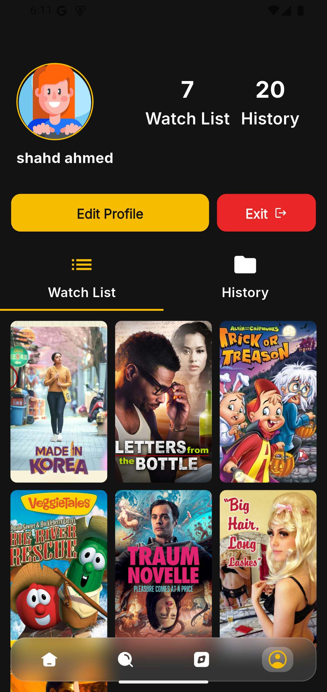
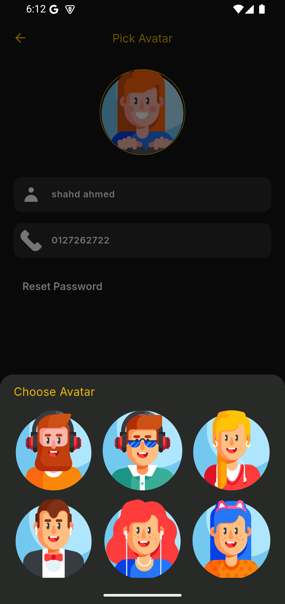
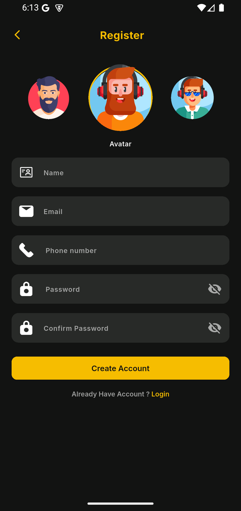
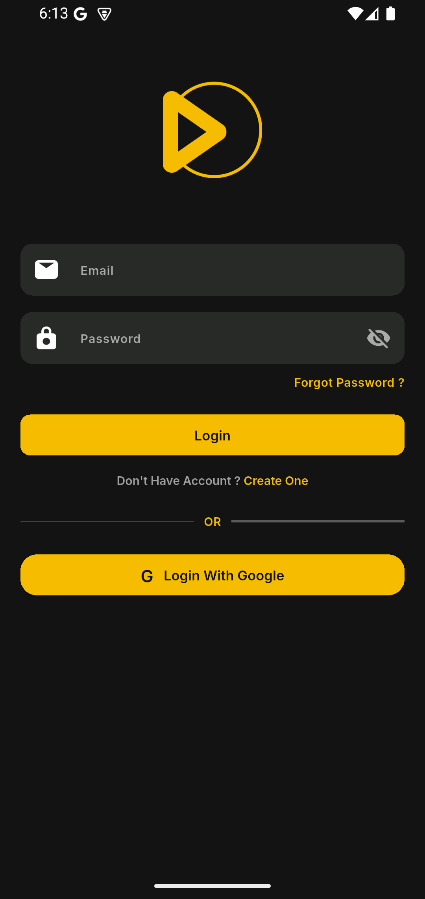
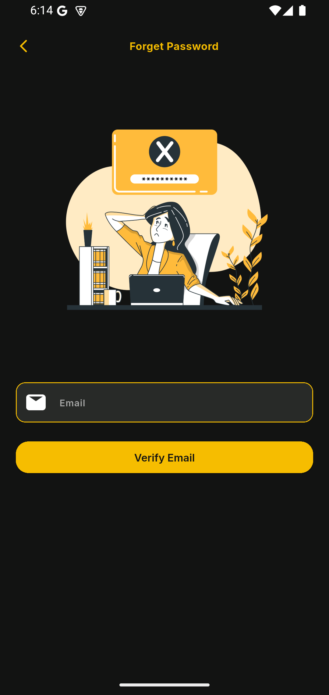

# 🎬 Movie App

**Movie App** is a Flutter-based mobile application built with **Clean Architecture** principles.
It allows users to browse, search, and view detailed information about movies while providing authentication, profile management, and a smooth responsive UI.

**Demo / Screen Recording:**
[Watch the Movie App Demo](https://drive.google.com/file/d/1yVCqPI3b4lf6MdrfZtAK2vGY3k4uouX7/view?usp=sharing)

---

## 📦 Project Structure

```
lib/
├── core/
│   ├── api/          # API configuration and base classes
│   ├── errors/       # Error handling classes
│   ├── utils/        # Utility functions and helpers
│   └── widgets/      # Shared/reusable widgets
├── config/
│   ├── routes/       # App routing configuration
│   └── theme/        # App theme configuration
└── features/
    ├── auth/         # Authentication feature
    │   ├── data/
    │   ├── domain/
    │   └── presentation/
    ├── home/         # Home screen feature
    │   ├── data/
    │   ├── domain/
    │   └── presentation/
    ├── movie_details/ # Movie details feature
    ├── search/        # Search feature
    └── profile/       # User profile feature
```

---

## ⚙️ Technologies & Dependencies

* **Flutter & Dart**: Mobile framework and language
* **State Management**: `flutter_bloc`, `bloc`, `equatable`
* **Networking**: `dio`, `pretty_dio_logger`
* **Dependency Injection**: `get_it`, `injectable`
* **Functional Programming**: `dartz`
* **Image Caching**: `cached_network_image`
* **Local Storage**: `shared_preferences`
* **Routing**: `go_router`
* **UI & Design**: `flutter_screenutil`, `gap`, `google_fonts`, `skeletonizer`, `carousel_slider`
* **Firebase**: `firebase_core`, `firebase_auth`, `cloud_firestore`, `google_sign_in`
* **Splash Screen**: `flutter_native_splash`

**Dev Dependencies**: `flutter_test`, `flutter_lints`, `injectable_generator`, `build_runner`

---

## 🚀 Features

* User authentication: Login, Register, Password Reset
* Browse popular and trending movies
* Search movies by title
* Detailed movie view (description, rating, cast, etc.)
* Profile management and update profile
* Responsive design for different screen sizes
* Image caching for better performance
* Firebase integration for auth and database
* Smooth navigation with routing and state management

---

## 🏛 Architecture

This app follows **Clean Architecture** principles:

* **Presentation Layer**: Screens, widgets, and state management
* **Domain Layer**: Business logic and entities
* **Data Layer**: Repositories, models, and API/data sources

---

## 📱 Screenshots

### 🏠 Home & Browse

<p align="center">
  
  
  
  
</p>

### 🎥 Movie Details

<p align="center">
  
  
  
</p>

### 🔎 Search

<p align="center">
  
</p>

### 👤 Profile & Authentication

<p align="center">
  
  
  
  
  
</p>

---

